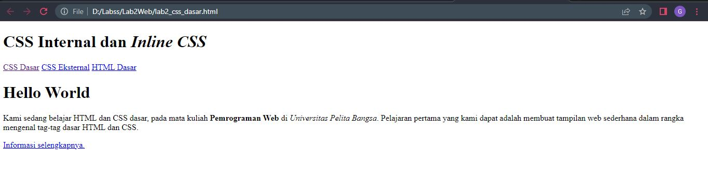
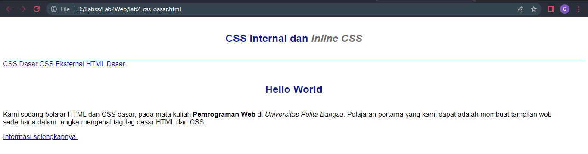
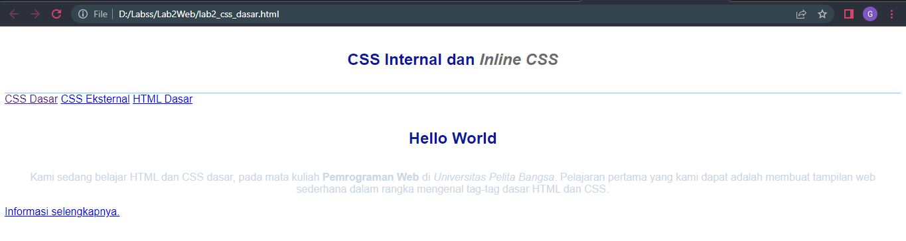
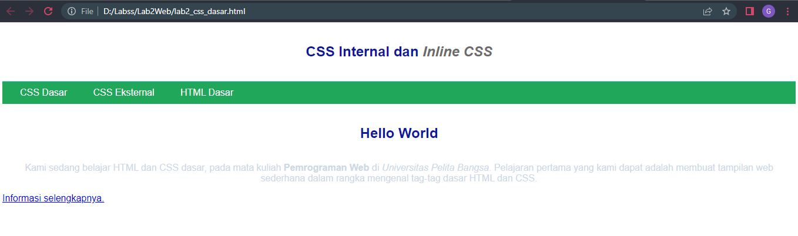
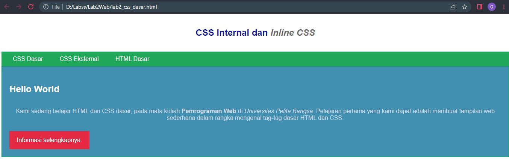

# Lab2Web
Praktikum2

# CSS
## Membuat dokumen HTML
Ini adalah tampilannya

## Mendeklarasikan CSS Internal
Menambahkan deklarasi CSS internal pada bagian head dokumen
Ini adalah tampilannya

## Menambahkan Inline CSS
Menambahkan deklarasi inline CSS pada tag '
'
Ini adalah tampilannya

## Membuat CSS Eksternal
Ini adalah tampilannya

## Menambahkan CSS Selector
Menambahkan CSS Selector menggunakan ID dan Class Selector
Ini adalah tampilannya
